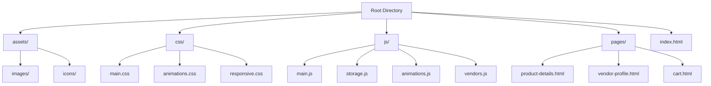

# Multi-vendor E-commerce Marketplace

A professional and elegant e-commerce platform supporting multiple vendors with modern UI/UX and smooth animations.

## Project Overview

This project is a multi-vendor marketplace that allows different sellers to list and sell their products through a unified platform. The website features a clean, modern design with smooth animations and responsive layout.

## Project Structure

## Core Features

### User Features
- User Authentication (both customers and vendors)
- Advanced Product Search and Filtering
- Shopping Cart with Local Storage
- Order Tracking System
- Wishlist Management
- Product Reviews and Ratings

### Vendor Features
- Vendor Profiles and Dashboards
- Product Management System
- Order Management
- Sales Analytics
- Inventory Tracking

### Technical Features
- Responsive Design
- Modern Animations and Transitions
- Local Storage for Cart and User Preferences
- Advanced Search Functionality
- Dynamic Product Filtering
- Real-time Form Validation

## UI/UX Components

### Header Section
- Logo
- Search Bar with Advanced Filters
- Shopping Cart Icon with Count
- User Account Menu
- Vendor Dashboard Link

### Main Navigation
- Product Categories
- Featured Products
- New Arrivals
- Special Offers
- Vendor Directory

### Product Display
- Grid/List View Toggle
- Sort Options
- Filter Panel
- Quick View Modal
- Add to Cart Animation

### Shopping Cart
- Mini Cart Preview
- Quantity Adjustments
- Price Calculations
- Checkout Process
- Order Summary

## Technical Implementation

### Frontend Technologies
- HTML5
- CSS3 (with Flexbox/Grid)
- Vanilla JavaScript (ES6+)
- Local Storage API

### Animation Strategy
- Smooth Page Transitions
- Cart Update Animations
- Loading States
- Hover Effects
- Modal Animations
- Scroll Animations

### Performance Optimization
- Lazy Loading Images
- Minified Assets
- Optimized Asset Delivery
- Efficient DOM Updates
- Local Storage Caching

## Development Phases

1. **Phase 1: Basic Structure**
   - Project Setup
   - Basic HTML Structure
   - CSS Framework Implementation
   - Responsive Design Foundation

2. **Phase 2: Core Functionality**
   - Product Display
   - Shopping Cart
   - Local Storage Integration
   - Search & Filter Implementation

3. **Phase 3: User Interface**
   - Animations Implementation
   - UI/UX Enhancements
   - Responsive Testing
   - Performance Optimization

4. **Phase 4: Vendor Features**
   - Vendor Profiles
   - Product Management
   - Order Tracking
   - Analytics Dashboard

5. **Phase 5: Final Polish**
   - Bug Fixes
   - Performance Optimization
   - Cross-browser Testing
   - Documentation